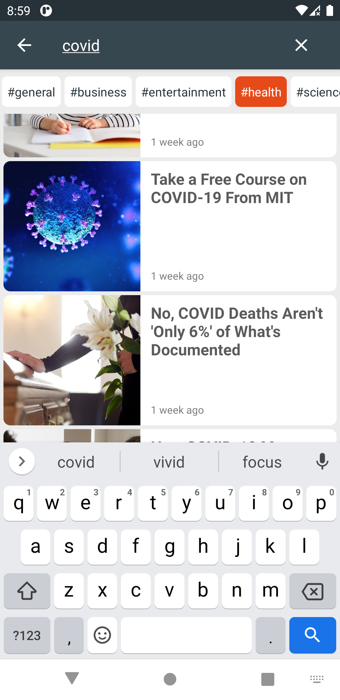
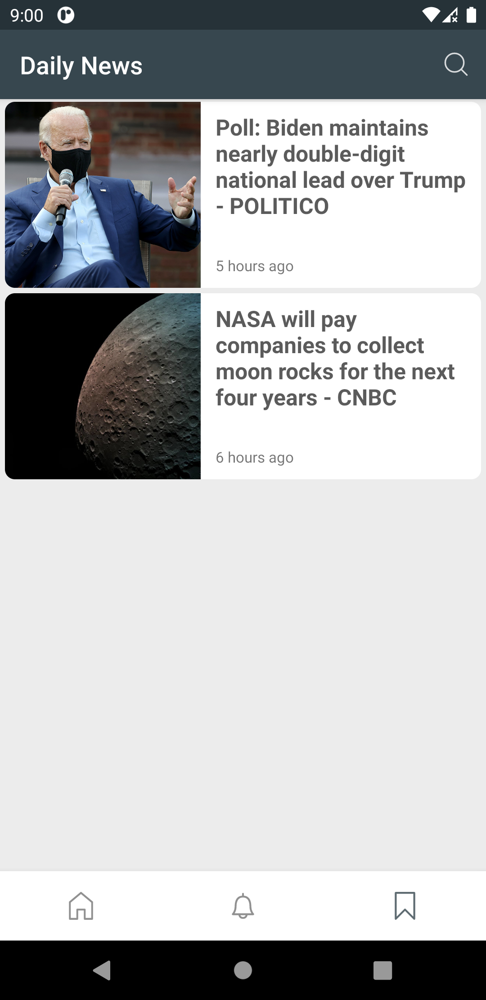
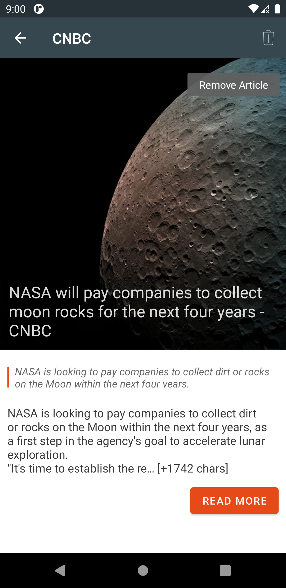

## DailyNews Android App
A very simple app that contains the following:

- Written in kotlin
- MVVM architecture
- Using kotlin Coroutines, Retrofit, Room Database and more

## UI Stuff and Libraries
- Icons [From Here](https://www.flaticon.com/packs/essential-set-2)
- Material Design and Navigation Components were used to
- [Pretty TimeAgo](https://github.com/shamalka/Pretty-TimeAgo-android-library) library 
## Preview

  
  
  

 

  
  
  

## Enjoy
